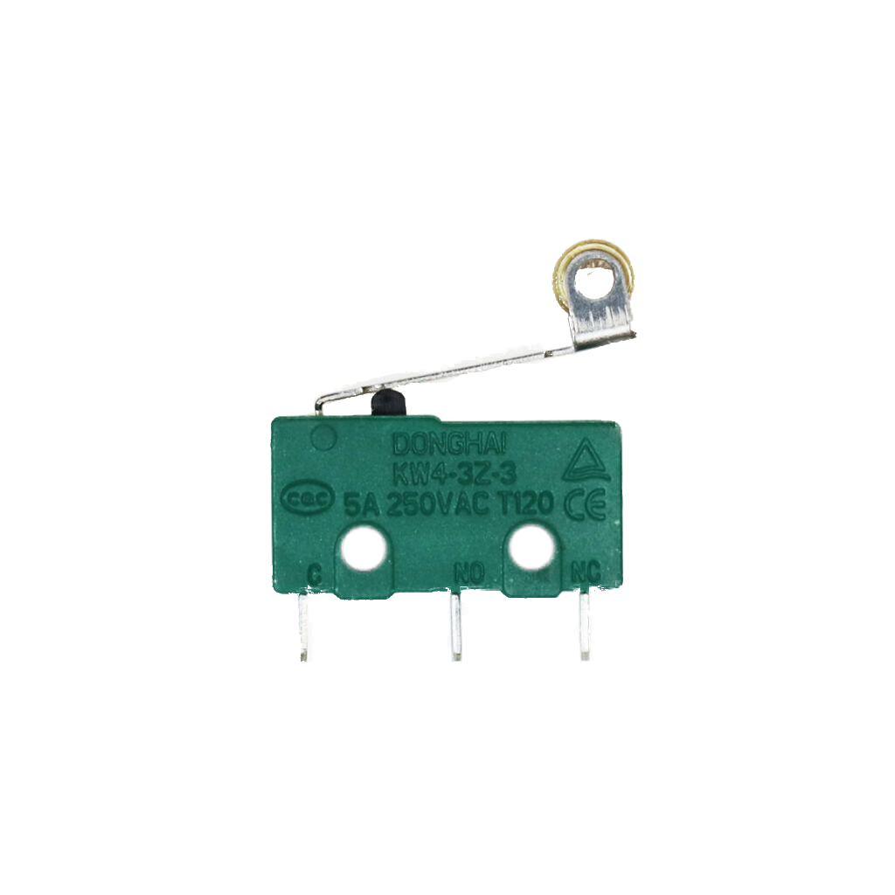

# Endschalter/Anschlag

## Beschreibung

Der Endschalter funktioniert wie ein normaler Schalter und kann als Eingabe für einen Mikrocontroller verwendet werden. 
Der Schalter besitzt einen elastischen Schaltarm, der einen elektrischen Kontakt zwischen den Anschlusspins herstellt, wenn der Arm gedrückt wird.

<!-- more_details -->

Der Schalter kann an einen Arduino oder Raspberry Pi angeschlossen werden und benötigt nur einen digitalen Pin.

Um den Schaltvorgang mit einem Mikrocontroller zu erfassen, wird ein digitaler Pin des Controllers mit der einen Seite des Schalters verbunden.
der zweite Anschluss mit Masse / GND.
In *ruhe* wird er Pin im inneren des Controllers *auf VCC gezogen*  (beim Arduino +5V). 
Dies geschieht über einen internen zuschaltbaren hochohmigen Widerstand. `Pull-Up` genannt.
Sobald der Schalter betätigt wird, fließt ein ganz kleiner Strom zu Masse.
Damit wird nun der Pin des Controllers *auf Masse gezogen*.
und genau diesen Unterschied kann der Controller erfassen.

Der Endschalter kommt vor allem bei Robotern oder anderen bewegten Maschinen zum Einsatz, um Kollisionen zu erkennen und zu vermeiden. 
Dafür wird beispielsweise ein Endschalter am Ende einer Schiene platziert, auf der ein Laufwagen läuft. 
Kommt der Laufwagen zu nah an das Ende der Schiene, kollidiert er mit dem Schaltarm des Endschalters und betätigt ihn somit. 
So wird die bevorstehende Kollision erkannt und kann vermieden werden.

## Anschlüsse

### Eingang

-   Mechanische Betätigung

### Ausgang

-   3 Kontakte (NC-C-NO)
    -   C = Common (gemeinsamer Anschluss)
    -   NC = Normal Closed (im ungedürckten zustand mit C verbunden)
    -   NO = Normal Open (im gedürckten zustand mit C verbunden)

## Kurz-Datenblatt

-   Schaltleistung: 5A 125VAC

[Hersteller Datenblatt](https://asset.conrad.com/media10/add/160267/c1/-/de/000707243DS01/datenblatt-707243-hartmann-mikroschalter-mbb1-01-a-01-c-09-a-250-vac-5-a-1-x-einein-tastend-1-st.pdf)

## Siehe Auch

-   -

## library

keine library nötig.

## Beispiele

!!!show-examples:./examples/

## Anleitung

-   schließe den Endschalter wie folgt an:
    -   C an GND
    -   NO an D2
-   nehm Beispiel Code
    -   kopiere von hier drüber in neuen leeren arduino sketch
    -   oder direkt über das Menü der Arduino IDE \*1:
        `Datei-Beispiele-MakeYourSchool-Taster-Endschalter-Endschalter_Minimal`
-   Sketch Hochladen
-   Das Sollte nun passieren:
    -   Öffne den Serial-Monitor (Symbol ganz rechts oben in der IDE)
    -   Wenn du nun den Endschalter drückst sollte `Endschalter wurde gerade gedrückt!` angezeigt werden.
    -   Wenn du ihn wieder los lässt sollte `Endschalter wurde wieder geöffnet` angezeigt werden.

\*1: dafür musst du einmalig die `MakeYourSchool` library installiert haben.
diese bringt alle hier im system vorhandenen Beispielcodes in die IDE..

## Wichtige Links für die ersten Schritte:

- [Datenblatt](https://asset.conrad.com/media10/add/160267/c1/-/de/000707243DS01/datenblatt-707243-hartmann-mikroschalter-mbb1-01-a-01-c-09-a-250-vac-5-a-1-x-einein-tastend-1-st.pdf)

## Projektbeispiele:

- [Kameraslider mit Endschalter](http://hmr-video.de/slider.html)

## Weiterführende Hintergrundinformationen:

- [Schalter](<https://de.wikipedia.org/wiki/Schalter_(Elektrotechnik)>) [(Elektrotechnik)](<https://de.wikipedia.org/wiki/Schalter_(Elektrotechnik)>) [- Wikipedia Artikel](<https://de.wikipedia.org/wiki/Schalter_(Elektrotechnik)>)
- [Positionsschalter - Wikipedia Artikel](https://de.wikipedia.org/wiki/Positionsschalter)
- [GPIO - Wikipedia Artikel](https://de.wikipedia.org/wiki/Allzweckeingabe/-ausgabe)
